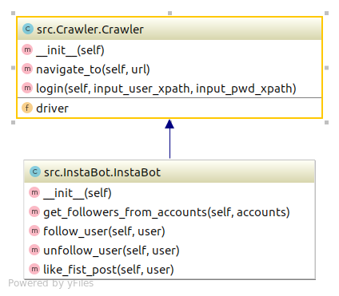

***
RPA Instagram
==============================
# Robô para seguir e curtir fotos dos usuários.
Web Crawler, Selenium, webdriver, Python, Pandas, RPA
***

***
## Instruções 
***
> 1. criar ambiente virtual (opcional)
>	- `make create_environment`
>   - `workon rpa-insta`
>
> 2. instalar dependências
> 	- `make requirements`
>
> 3. baixar e descompactar webdriver (Chrome) compatível com a versão do seu navegador
>   
> 4. criar .env e adicionar variáveis:
>	- chromedriver_path=local/do/webdriver 
>   - base=https://instagram.com
>	- user=usuario
>   - pwd=senha_da_conta
> 5. no diretório raiz do projeto, com o ambiente de desenvolvimento ativado, rode:
>   - `python -m src.main`
***
## Checklist
***

- Fluxo a ser automatizado é :
    - ✅ Entrar no site: http://www.instagram.com;
    - ✅ Efetuar login;
    - ✅ Acessar uma lista de páginas/contas e para cada uma fazer:
        - ✅ Obter lista de seguidores (usuários);
        - ✅ Armazenar em arquivo .csv.
    - ✅ Acessar cada página da lista de usuários salva no arquivo e:
        - ✅ Clicar em seguir
        - ✅ Se houver postagens (públicas), curtir a última

 Organização do Projeto
------------

    ├── LICENSE
    ├── Makefile           <- Makefile com comandos úteis como `make create_environment` or `make clean`
    ├── README.md          <- The top-level README for developers using this project.
    ├── data		       <- Onde os dados são armazenados
    │   
    ├── requirements.txt   <- The requirements file for reproducing the analysis environment, e.g.
    │                         generated with `pip freeze > requirements.txt`
    │
    ├── setup.py           <- makes project pip installable (pip install -e .) so src can be imported
    ├── src                <- Source code for use in this project.
        ├── __init__.py    <- Makes src a Python module
        │
        ├── Crawler.py     <- Classe genérica de web crawler
        │   
        ├── InstaBot.py    <- Classe que herda de Crawler com propósito de automatizar interação no instagram
       

--------

<small>Project based on the <a target="_blank" href="https://drivendata.github.io/cookiecutter-data-science/">cookiecutter data science project template</a>. #cookiecutterdatascience</small>

